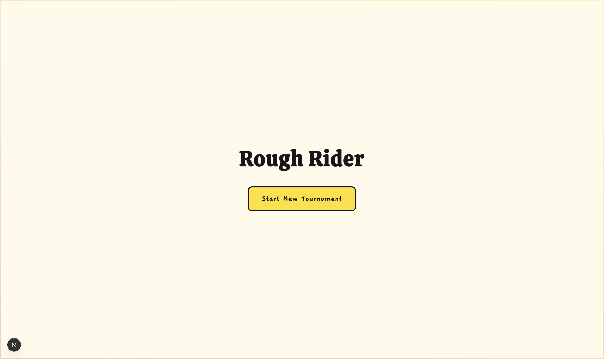
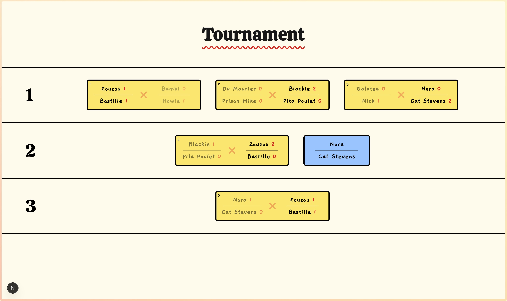

# 🎯 Rough Rider: Tournament Tracker


<br/>


The web app no one's been waiting for is here, no more scrambling for pen and
paper and wasting precious cabin time with convoluted tournament systems when
you just want to get a bit Rough with your fellow Riders.
The **Rough Rider App** takes care of it all so you can just relax and throw
some darts at beer cans the way you were meant to.

The app manages team selection, tournament setup, score tracking, and player &
team stats. Built with React, Next.js, TailwindCSS, and Firebase.

---

## 🪑 What is Rough Rider?

**Rough Rider** (also known as *Beer Darts* in less professional settings) is a
game of
mysterious origins consisting of teams of 2 players
sitting opposite each other, roughly 4-5 meters apart, and taking turns
throwing darts at each
opposing
player's canned drink of choice. The team that pierces their opponent's two
cans
first takes the win.

---

## 🛠️ Tech Stack

- **Next.js**
- **React**
- **TypeScript**
- **Tailwind CSS**
- **Firebase (Auth, Firestore)**
- **Vercel (when deployed)**

---

## 🚀 Key Features

**Legend:** ✅ Complete • 🚧 In Development • 📋 Planned

### 🚧 Team Management

- 🚧 Random team assignment
- ✅ Manual team assignment
- 🚧 Add/remove players

### 🚧 Tournament Setup

*Auto-generate brackets depending on the selected tournament style*

- ✅ Single elimination
- 🚧 Group phase + playoffs
- 📋 Round-robin + playoffs
- 📋 Allow bracket edits/customizations

### 🚧 Match Tracking

- ✅ Track player & team scores during matches
- 📋 Live match updates to support multiple viewers
- 📋 Score updates locked to a "referee" account

### 🚧 Tournament Management

*Auto-advance teams as matches are completed*

- ✅ Single elimination
- 🚧 Group phase + playoffs
- 📋 Round-robin + playoffs

### 🚧 View team and player stats

### 📋 Additional features

- 📋 En Français!
- 📋 View past tournaments
- 📋 Optional time tracking for matches
- 📋 Notify the "next-up" team so they can get ready
- 📋 Upload team & tournament photos

---

## ✨ Preview

<details>
<summary><b>Click to view screenshots of latest version</b></summary>
<h3>Landing:</h3>


<h3>Team Selection:</h3>


<h3>Tournament Setup:</h3>




<h3>Match tracking:</h3>


</details>

---

## ⚙️ Running the App while in Development

#### 1. Clone the repo

```bash
git clone https://github.com/rafacmaia/rough-rider.git
cd rough-rider
```

#### 2. Install dependencies: `npm install`

#### 3. Start the dev server: `npm run dev`

#### 4. Access the indicated localhost, usually http://localhost:3000, and start your tournament!

---

## 🤝 Contributing

This is mostly a personal practice project around a game my friends and I
occasionally play, but ideas, suggestions, issues, and PRs are welcome, don't
hesitate to reach out!

---

## 📜 License

MIT License – feel free to use, share, and remix it at will. If you do, a link
back here would be super nice!

---

## 🎨 Attributions

- “Beer Can” icon used on the match page
  by [Caroline Mackay](https://carolinemackay.com/) from the [Noun
  Project](https://thenounproject.com/browse/icons/term/beer-can/) (CC BY 3.0).
- "Beer Can" (crushed) icon used on the match page
  by [Mike O.](https://redtablepress.com/) from the [Noun
  Project](https://thenounproject.com/browse/icons/term/beer-can/) (CC BY 3.0).
- "Dart SVG Vector" icon used on the match page
  by [Game Icons.net](https://game-icons.net/?ref=svgrepo.com)
  from [SVG Repo](https://www.svgrepo.com/)
  ([CC Attribution License](https://creativecommons.org/licenses/by/4.0/))

